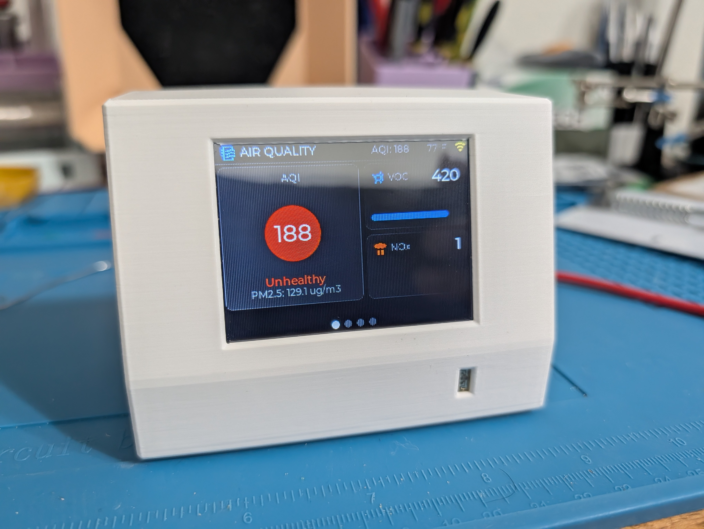
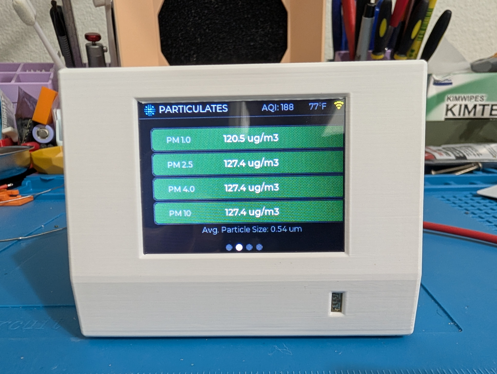
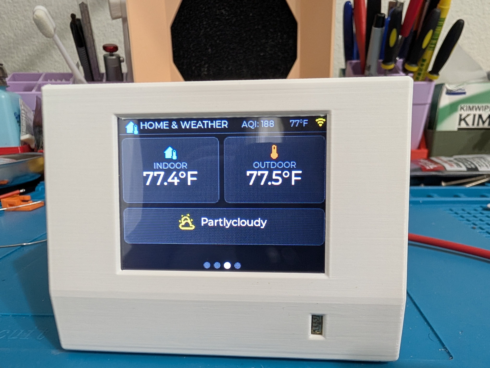
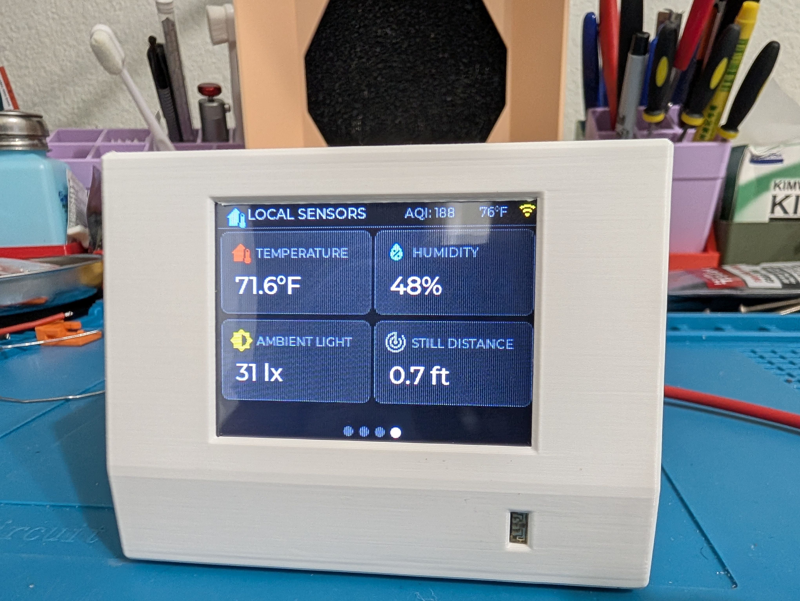
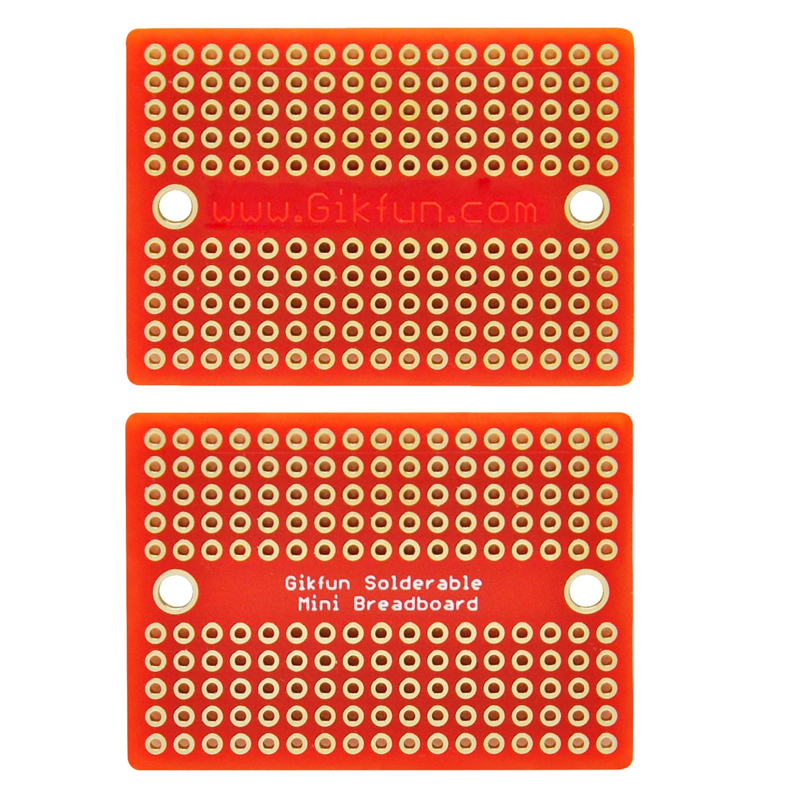

# 🌬️ Air Quality Station

A feature-rich indoor air quality monitor built with **ESPHome**, **LVGL**, and **Home Assistant**. Displays real-time AQI, particulate matter, VOC, NOx, temperature, humidity, ambient light, and presence data on a touchscreen ILI9341 display — all powered by a Seeed XIAO ESP32-S3.


---

## 📸 Screenshots

| Page 1 — Air Quality | Page 2 — Particulates | Page 3 — Home & Weather | Page 4 — Local Sensors |
|:---:|:---:|:---:|:---:|
|  |  |  |  |

---

## ✨ Features

### Display & UI
- **4-page LVGL touchscreen UI** with swipe navigation and animated page transitions
- **Real-time US EPA AQI** calculated on-device from PM2.5 with color-coded badge (Good → Hazardous)
- **Dark cockpit design** — EEMUA 201 / ISA-101 compliant HMI principles
- **Status bar** — persistent AQI, indoor temperature, and WiFi signal indicator across all pages
- **Auto-scroll** — pages automatically cycle when presence is detected, resets on touch
- **Page indicator dots** — visual navigation feedback at bottom of each page

### Sensors (On-Device)
| Sensor | Measures | Interface |
|---|---|---|
| **Sensirion SPS30** | PM1.0, PM2.5, PM4.0, PM10, particle size | I2C |
| **Sensirion SGP4x** | VOC Index, NOx Index | I2C |
| **Sensirion SHT41** | Temperature, Humidity | I2C |
| **VEML7700** | Ambient Light (lux) | I2C |
| **HLK-LD2412** | mmWave human presence, distance | UART |

### Smart Features
- **Presence-based backlight** — display turns on/off based on LD2412 radar detection
- **Scheduled radar restart** — LD2412 automatically restarts at 3:00 AM daily via SNTP
- **Home Assistant integration** — pulls indoor/outdoor temperature and weather conditions from HA
- **WiFi signal monitoring** — color-coded WiFi icon (green/yellow/orange/red)
- **Boot-time widget refresh** — all display widgets populated from sensor states after API connects
- **NaN-safe rendering** — all values display `--` when sensor data is unavailable

---

## 🔧 Hardware

### Bill of Materials

| Component | Description | Qty | Approx. Cost |
|---|---|---|---|
| Seeed XIAO ESP32-S3 | MCU with PSRAM, WiFi | 1 | $8 |
| ILI9341 2.8" TFT | 320×240 LCD with XPT2046 touch | 1 | $10 |
| Sensirion SPS30 | Laser particulate matter sensor | 1 | $35 |
| Sensirion SGP41 | VOC + NOx gas sensor | 1 | $10 |
| Sensirion SHT41 | Temperature + humidity sensor | 1 | $6 |
| VEML7700 | Ambient light sensor | 1 | $5 |
| HLK-LD2412 | 24GHz mmWave radar | 1 | $5 |
| Gikfun Protoboard | 17×10 solderable mini breadboard | 1 | $2 |
| Dupont wires / headers | Hookup wire | — | $3 |

**Total estimated cost: ~$84**

### Pin Mapping (XIAO ESP32-S3)

| XIAO Pin | GPIO | Function | Connected To |
|---|---|---|---|
| D0 | GPIO1 | Touch CS | XPT2046 T_CS |
| D1 | GPIO2 | Display CS | ILI9341 CS |
| D2 | GPIO3 | Display DC | ILI9341 DC/RS |
| D3 | GPIO4 | Backlight | ILI9341 LED |
| D4 | GPIO5 | I2C SDA | SPS30, SGP41, SHT41, VEML7700 |
| D5 | GPIO6 | I2C SCL | SPS30, SGP41, SHT41, VEML7700 |
| D8 | GPIO7 | SPI CLK | ILI9341 SCK, XPT2046 T_CLK |
| D9 | GPIO8 | SPI MISO | ILI9341 SDO, XPT2046 T_DO |
| D10 | GPIO9 | SPI MOSI | ILI9341 SDI, XPT2046 T_DIN |
| D6 | GPIO43 | UART TX | LD2412 RX |
| D7 | GPIO44 | UART RX | LD2412 TX |
| 5V | — | 5V Power | SPS30, LD2412 |
| 3V3 | — | 3.3V Power | Display, SGP41, SHT41, VEML7700 |
| GND | — | Ground | All components |

### Wiring Diagram

```
                    ┌─────────────────────┐
                    │   XIAO ESP32-S3     │
                    │                     │
    ┌───────────────┤ GPIO5 (SDA)         │
    │  ┌────────────┤ GPIO6 (SCL)         │
    │  │            │                     │
    │  │  ┌─────────┤ GPIO7 (SPI CLK)     │
    │  │  │ ┌───────┤ GPIO8 (SPI MISO)    │
    │  │  │ │ ┌─────┤ GPIO9 (SPI MOSI)    │
    │  │  │ │ │     │                     │
    │  │  │ │ │ ┌───┤ GPIO1 (Touch CS)    │
    │  │  │ │ │ │ ┌─┤ GPIO2 (Disp CS)     │
    │  │  │ │ │ │ │ ┌┤ GPIO3 (Disp DC)    │
    │  │  │ │ │ │ │ │┤ GPIO4 (Backlight)  │
    │  │  │ │ │ │ │ ││                    │
    │  │  │ │ │ │ │ ││ ┌──┤ GPIO43 (TX)   │
    │  │  │ │ │ │ │ ││ │┌─┤ GPIO44 (RX)   │
    │  │  │ │ │ │ │ ││ ││ │               │
    │  │  │ │ │ │ │ ││ ││ └───────────────┘
    │  │  │ │ │ │ │ ││ ││
    │  │  │ │ │ │ └─┤├─┤├── ILI9341 + XPT2046
    │  │  │ │ │ │   ││ ││   (Display + Touch)
    │  │  └─┘ └─┘   ││ ││
    │  │             ││ ││
    ├──┼─── SPS30    ││ └┴── LD2412
    ├──┼─── SGP41    ││      (mmWave Radar)
    ├──┼─── VEML7700 ││
    └──┴─── SHT41   ││
     (I2C Bus)       ││
                     └┘
```

### I2C Bus Addresses

| Sensor | Address | Notes |
|---|---|---|
| SPS30 | `0x69` | Laser PM sensor |
| SGP41 | `0x59` | VOC/NOx (default) |
| SHT41 | `0x44` | Temp/Humidity (default) |
| VEML7700 | `0x10` | Light sensor (default) |

> **Note:** All four I2C sensors share the same bus (GPIO5/GPIO6) at 100kHz. No address conflicts.

---

## 🏗️ Protoboard Wiring Plan

Uses a **17×10 Gikfun solderable mini breadboard** (columns A-E connected left, F-J connected right).

<p align="center">
  
</p>

### Allocation Map

| Row | Left (A-E) | Right (F-J) |
|:---:|:---|:---|
| 1-2 | *(mounting)* | *(mounting)* |
| **3** | **5V Rail** | *(buffer)* |
| **4** | *(buffer)* | **GND Rail 1** |
| **5** | **3.3V Rail 1** | *(buffer)* |
| **6** | *(buffer)* | **GND Rail 2** ↔ bridge J4 |
| **7** | **I2C SDA (GPIO5)** | *(buffer)* |
| **8** | *(buffer)* | **I2C SCL (GPIO6)** |
| **9** | **SPI SCK (GPIO7)** | **SPI MOSI (GPIO9)** |
| **10** | *(buffer)* | *(buffer)* |
| **11** | **SPI MISO (GPIO8)** | **Display CS (GPIO2)** |
| **12** | *(buffer)* | *(buffer)* |
| **13** | **Display DC (GPIO3)** | **Display LED (GPIO4)** |
| **14** | **Touch CS (GPIO1)** | **3.3V Rail 2** ↔ bridge E5 |
| **15** | **UART TX (GPIO43)** | **UART RX (GPIO44)** |
| 16-17 | *(mounting)* | *(mounting)* |

### Required Solder Bridges

1. **J4 → F6** — extends GND across two right-side rows
2. **E5 → F14** — extends 3.3V from left Rail 1 to right Rail 2

---

## 📊 Display Pages

### Page 1 — Air Quality Overview
The primary "at-a-glance" page. Large AQI badge with color-coded background (green through maroon), VOC and NOx index bars, and PM2.5 reference value.

### Page 2 — Particulate Detail
Four horizontal bars (PM1.0, PM2.5, PM4.0, PM10) with numeric overlays showing µg/m³ values. Average particle size displayed at bottom.

### Page 3 — Home & Weather
Indoor temperature (from HA thermostat), outdoor temperature (from HA sensor), and current weather condition with dynamic icon mapping (14 weather conditions supported).

### Page 4 — Local Sensors
Real-time readings from on-board sensors: temperature (SHT41, °F), humidity (SHT41, %), ambient light (VEML7700, lux), and still distance (LD2412, feet).

### Navigation
- **Swipe left/right** to change pages (30px threshold)
- **Auto-scroll** cycles through pages every 15 seconds when presence is detected (30-second initial delay)
- **Page wrap** enabled (Page 4 → swipe right → Page 1)
- Touch anywhere resets the auto-scroll timer

---

## 🏠 Home Assistant Integration

### Entities Exported to HA

| Entity | Type | Description |
|---|---|---|
| `sensor.air_quality_station_pm_*` | sensor | PM1.0, PM2.5, PM4.0, PM10 mass concentrations |
| `sensor.air_quality_station_voc_index` | sensor | SGP4x VOC Index |
| `sensor.air_quality_station_nox_index` | sensor | SGP4x NOx Index |
| `sensor.air_quality_station_calculated_aqi` | sensor | US EPA AQI (calculated from PM2.5) |
| `sensor.air_quality_station_sht41_temperature` | sensor | Local temperature |
| `sensor.air_quality_station_sht41_humidity` | sensor | Local humidity |
| `sensor.air_quality_station_ambient_light` | sensor | Ambient light (lux) |
| `binary_sensor.air_quality_station_human_presence` | binary_sensor | mmWave presence detection |
| `sensor.air_quality_station_*_distance` | sensor | Moving/still detection distance |
| `light.air_quality_station_display_backlight` | light | Display backlight control |
| `sensor.air_quality_station_wifi_signal` | sensor | WiFi RSSI (dBm) |

### Entities Imported from HA

These entities must exist in your Home Assistant for Page 3 to display data:

| Entity ID | Description |
|---|---|
| `sensor.outdoor_temp_and_humidity_sensor_temperature` | Outdoor temperature (°F) |
| `sensor.upstairs_thermostat_current_temperature` | Indoor temperature (°F) |
| `sensor.openweathermap_condition` | Weather condition text |

> **Customization:** Update the `entity_id` values in the `homeassistant` sensor section of `aqistation.yaml` to match your own HA entities.

---

## 🚀 Getting Started

### Prerequisites

- [ESPHome](https://esphome.io/) 2024.x or later (with LVGL support)
- [Home Assistant](https://www.home-assistant.io/) (for weather/temperature imports)
- Hardware listed in the [Bill of Materials](#bill-of-materials)

### Installation

1. **Download Configuration:** Download the `aqistation.yaml` file from this repository.
2. **Update Credentials:** Update the key information at the top of the file including your WiFi SSID/password, fallback hotspot password, and device names.
3. **Install:** Flash the firmware to your ESP32-S3 using the standard ESPHome dashboard or CLI.

### First Boot

On first boot, the device will:
1. Connect to WiFi and the Home Assistant API
2. Wait for sensor data to populate (SPS30 takes ~30 seconds, SGP4x takes ~60 seconds to warm up)
3. Refresh all display widgets once data is available
4. Start auto-scrolling pages if presence is detected
5. Turn off backlight after 2 minutes if no one is present

---

## ⚙️ Configuration

### Substitutions

These values at the top of `aqistation.yaml` can be easily customized:

| Variable | Default | Description |
|---|---|---|
| `devicename` | `aqi-station` | ESPHome device name (used in entity IDs) |
| `friendly_name` | `Air Quality Station` | Display name in Home Assistant |
| `refresh_interval` | `05` | Sensor update interval in seconds |
| `auto_scroll_start_delay` | `30` | Seconds before auto-scroll begins |
| `auto_scroll_interval` | `15` | Seconds between auto-scroll page changes |

### Home Assistant Entities

Don't forget to update the `entity_id` values in the `homeassistant` sensor platform block of the YAML file to match your actual Home Assistant indoor/outdoor temperature and weather entities. See [Entities Imported from HA](#entities-imported-from-ha) for more details.

### Temperature Units

The SHT41 temperature is converted to **Fahrenheit** on the display. To use Celsius, change the format string in the `sht_temp` `on_value` handler:

```yaml
# Fahrenheit (default):
format: "%.1f°F"
args: ['x * 1.8 + 32.0']

# Celsius:
format: "%.1f°C"
args: ['x']
```

### AQI Calculation

AQI is calculated using the **US EPA breakpoint table** from PM2.5 concentrations. The calculation runs on-device in a C++ lambda — no cloud dependency.

| AQI Range | PM2.5 (µg/m³) | Badge Color | Label |
|---|---|---|---|
| 0–50 | 0.0–12.0 | 🟢 Green | Good |
| 51–100 | 12.1–35.4 | 🟡 Yellow | Moderate |
| 101–150 | 35.5–55.4 | 🟠 Orange | Sensitive |
| 151–200 | 55.5–150.4 | 🔴 Red | Unhealthy |
| 201–300 | 150.5–250.4 | 🟣 Purple | Very Bad |
| 301–500 | 250.5+ | 🟤 Maroon | Hazardous |

---

## 📝 License

This project is available under the [Creative Commons Attribution-NonCommercial-ShareAlike 4.0 International License](LICENSE). You may not use the material for commercial purposes without explicit permission from the author.

---

## 🙏 Acknowledgments

- [ESPHome](https://esphome.io/) — firmware framework
- [LVGL](https://lvgl.io/) — graphics library
- [Sensirion](https://sensirion.com/) — sensor manufacturer (SPS30, SGP4x, SHT4x)
- [Home Assistant](https://www.home-assistant.io/) — smart home platform
