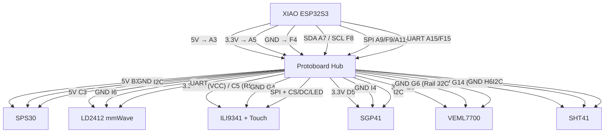

# Air Quality Station — Protoboard Wiring Plan (v3 — Final)

## 1. Protoboard Allocation Map

**17×10 Gikfun Solderable Mini Breadboard.** Columns A-E connected (left), F-J connected (right).
Rows 1-2 and 16-17 reserved for mounting (empty). Usable rows: **3-15**.

**Design principle:** Stagger left/right usage so that adjacent rows on the *same side* are rarely both occupied. Power and I2C zones have **perfect** buffers.

| Row | Left (A-E) | Right (F-J) |
|:---:|:---|:---|
| 1-2 | *(mounting)* | *(mounting)* |
| **3** | **5V Rail** | *(buffer)* |
| **4** | *(buffer)* | **GND Rail 1** |
| **5** | **3.3V Rail 1** | *(buffer)* |
| **6** | *(buffer)* | **GND Rail 2** ↔ bridge J4 |
| **7** | **I2C SDA (GPIO5)** | *(buffer)* |
| **8** | *(buffer)* | **I2C SCL (GPIO6)** |
| **9** | **SPI SCK (GPIO7)** | **SPI MOSI (GPIO9)** |
| **10** | *(buffer)* | *(buffer)* |
| **11** | **SPI MISO (GPIO8)** | **Display CS (GPIO2)** |
| **12** | *(buffer)* | *(buffer)* |
| **13** | **Display DC (GPIO3)** | **Display LED (GPIO4)** |
| **14** | **Touch CS (GPIO1)** | **3.3V Rail 2** ↔ bridge E5 |
| **15** | **UART TX (GPIO43)** | **UART RX (GPIO44)** |
| 16-17 | *(mounting)* | *(mounting)* |

### Buffer Analysis
| Side | Transition | Buffer? |
|:----:|:-----------|:-------:|
| Left | 3→5 | ✅ Row 4 empty |
| Left | 5→7 | ✅ Row 6 empty |
| Left | 7→9 | ✅ Row 8 empty |
| Left | 9→11 | ✅ Row 10 empty |
| Left | 11→13 | ✅ Row 12 empty |
| Left | 13→14 | ⚠️ Adjacent (Touch CS) |
| Left | 14→15 | ⚠️ Adjacent (UART TX) |
| Right | 4→6 | ✅ Row 5 empty |
| Right | 6→8 | ✅ Row 7 empty |
| Right | 8→9 | ⚠️ Adjacent (SPI MOSI) |
| Right | 9→11 | ✅ Row 10 empty |
| Right | 11→13 | ✅ Row 12 empty |
| Right | 13→14 | ⚠️ Adjacent (3.3V Rail 2) |
| Right | 14→15 | ⚠️ Adjacent (UART RX) |

> [!TIP]
> Power rails (rows 3-6) and I2C bus (rows 7-8) have **perfect** buffers on both sides. Only the bottom 3 rows (13-15) have adjacencies, and those carry few wires each (2 per rail).

### Required Solder Bridges
1. **J4 → F6** — extends GND across two right-side rows
2. **E5 → F14** — extends 3.3V from left Rail 1 to right Rail 2

---

## 2. Component Wiring Tables

### XIAO ESP32S3 → Protoboard
| Xiao Pin | GPIO | Function | Pad |
|:---|:---|:---|:---|
| 5V | — | 5V out | **A3** |
| 3V3 | — | 3.3V out | **A5** |
| GND | — | Ground | **F4** |
| D4 | GPIO5 | I2C SDA | **A7** |
| D5 | GPIO6 | I2C SCL | **F8** |
| D8 | GPIO7 | SPI SCK | **A9** |
| D10 | GPIO9 | SPI MOSI | **F9** |
| D9 | GPIO8 | SPI MISO | **A11** |
| D1 | GPIO2 | Display CS | **F11** |
| D2 | GPIO3 | Display DC | **A13** |
| D3 | GPIO4 | Display LED (Backlight) | **F13** |
| D0 | GPIO1 | Touch CS | **A14** |
| D6 | GPIO43 | UART TX → Radar RX | **A15** |
| D7 | GPIO44 | UART RX ← Radar TX | **F15** |

### Display (ILI9341 + XPT2046) → Protoboard
| Display Pin | Function | Pad |
|:---|:---|:---|
| VCC | 3.3V Power | **B5** |
| LED | Backlight (from GPIO4) | **G13** |
| GND | Ground | **G4** |
| SCK | SPI Clock | **B9** |
| SDI (MOSI) | SPI Data In | **G9** |
| SDO (MISO) | SPI Data Out | **B11** |
| CS | Display Select | **G11** |
| DC/RS | Data/Command | **B13** |
| RESET | Reset (tie to 3.3V) | **C5** |
| T_CLK | Touch Clock | **C9** |
| T_DIN | Touch MOSI | **H9** |
| T_DO | Touch MISO | **C11** |
| T_CS | Touch Select | **B14** |

### Sensors → Protoboard

| Sensor | Pin | Function | Pad |
|:---|:---|:---|:---|
| **SPS30** | VDC | 5V | **B3** |
| | GND | Ground | **H4** |
| | SDA | I2C Data | **B7** |
| | SCL | I2C Clock | **G8** |
| **SGP41** | VCC | 3.3V | **D5** |
| | GND | Ground | **I4** |
| | SDA | I2C Data | **C7** |
| | SCL | I2C Clock | **H8** |
| **VEML7700** | VCC | 3.3V | **E5** |
| | GND | Ground | **G6** |
| | SDA | I2C Data | **D7** |
| | SCL | I2C Clock | **I8** |
| **SHT41** | VCC | 3.3V | **G14** (Rail 2) |
| | GND | Ground | **H6** |
| | SDA | I2C Data | **E7** |
| | SCL | I2C Clock | **J8** |
| **LD2412** | VCC | 5V | **C3** |
| | GND | Ground | **I6** |
| | TX → ESP RX | UART (→ GPIO44) | **G15** |
| | RX ← ESP TX | UART (← GPIO43) | **B15** |

---

## 3. Visual Wiring Diagram



---

## 4. Pin Cross-Reference (YAML ↔ Wiring)

Verification of `aqistation.yaml` pin assignments against protoboard wiring:

| Function | YAML Config | GPIO | Protoboard Row | ✅ |
|:---|:---|:---|:---|:---:|
| I2C SDA | `i2c.sda: GPIO5` | GPIO5 | Row 7 Left | ✅ |
| I2C SCL | `i2c.scl: GPIO6` | GPIO6 | Row 8 Right | ✅ |
| SPI CLK | `spi.clk_pin: GPIO7` | GPIO7 | Row 9 Left | ✅ |
| SPI MISO | `spi.miso_pin: GPIO8` | GPIO8 | Row 11 Left | ✅ |
| SPI MOSI | `spi.mosi_pin: GPIO9` | GPIO9 | Row 9 Right | ✅ |
| Touch CS | `touchscreen.cs_pin: GPIO1` | GPIO1 | Row 14 Left | ✅ |
| Display CS | `display.cs_pin: GPIO2` | GPIO2 | Row 11 Right | ✅ |
| Display DC | `display.dc_pin: GPIO3` | GPIO3 | Row 13 Left | ✅ |
| Backlight | `output.pin: GPIO4` | GPIO4 | Row 13 Right | ✅ |
| UART TX | `uart.tx_pin: GPIO43` | GPIO43 | Row 15 Left | ✅ |
| UART RX | `uart.rx_pin: GPIO44` | GPIO44 | Row 15 Right | ✅ |

### UART Configuration (LD2412)
```yaml
uart:
  - id: uart_ld2412
    tx_pin: GPIO43
    rx_pin: GPIO44
    baud_rate: 115200
    parity: NONE
    stop_bits: 1
```

### I2C Configuration
```yaml
i2c:
  sda: GPIO5
  scl: GPIO6
  scan: true
  frequency: 100kHz
```

---

## 5. Status

All wiring and configuration items are **complete and verified**:

- [x] Protoboard allocation with buffer rows
- [x] All sensor wiring (SPS30, SGP41, VEML7700, SHT41, LD2412)
- [x] Display + touch wiring (ILI9341 + XPT2046)
- [x] Backlight GPIO control (GPIO4)
- [x] SGP41 compensation configured with SHT41 temp/humidity
- [x] UART for LD2412 radar (GPIO43 TX, GPIO44 RX, 115200 baud)
- [x] Presence-based backlight on/off
- [x] Scheduled LD2412 restart at 3:00 AM daily
- [x] All pin assignments verified against running YAML
